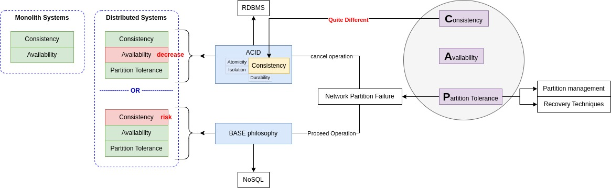

#CAP theorem

##definition
it believes you can provide every three Aspects (Consistency, Availability & Partition Tolerance) in monolith systems but in a distributed system you should make some considerations and make consistency or availability sacrifices.

##Concepts
`in a replicated system`
- **Consistency**
  - every `read` receives the most recent write or an error.
  - return the same data on read operation on all nodes.
- **Availability**
  - every request `receives a (non-error) response`, without the guarantee that it contains the most recent write.
- **Partition Tolerance**: ability to keep processing requests even if a node fails or its connection to the network is lost
- 

