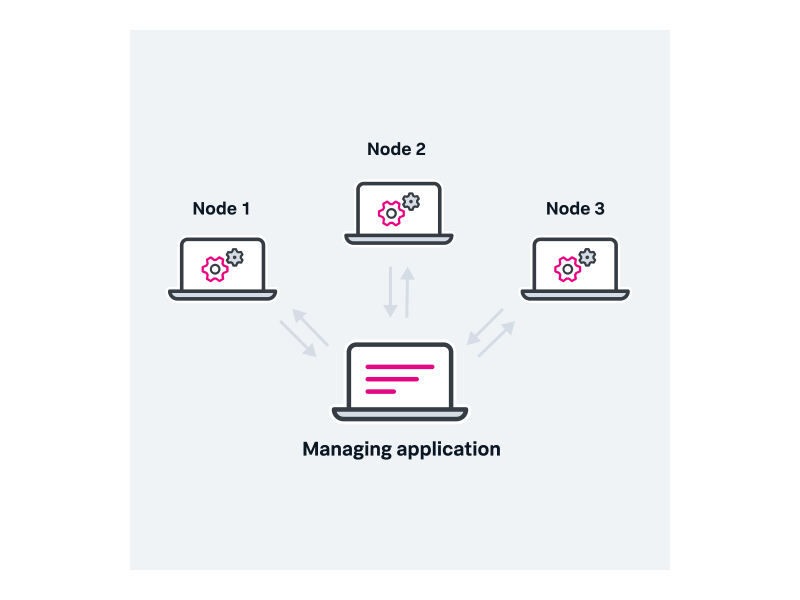
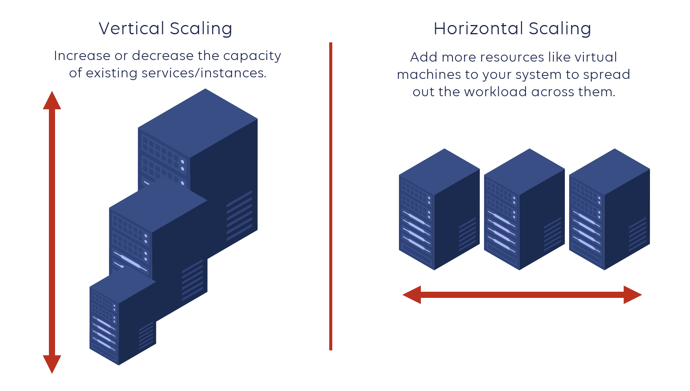

# Distributed Systems

## definition
- a system whose components are located on different networked computers, which communicate and coordinate their actions by passing messages to one another
- collection of nodes that communicate with each other over a network, using various protocols and approaches like RPC calls or messaging systems, to achieve a common objective

## Key Concepts
### Scalability
system’s ability to cope with increased load
- adding more resources to the system (when it's required)
- decrease used resources ( to cut the costs when it's not required)

**types**:
- **Vertical**: System Manipulation with resources on 1 machine
- **Horizontal**: addition of more nodes with same functionality (as the load-targeted node)

we focus on `horizontal scaling` in the Distributed Systems.
### Reliability
- probability that a component of a system will perform a required function for a given period of time when used under operating conditions
- ability to continue to operate even when facing different sorts of failures

