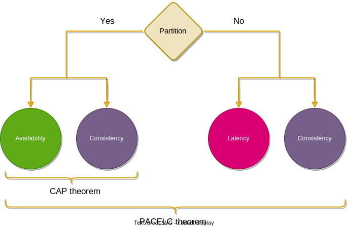
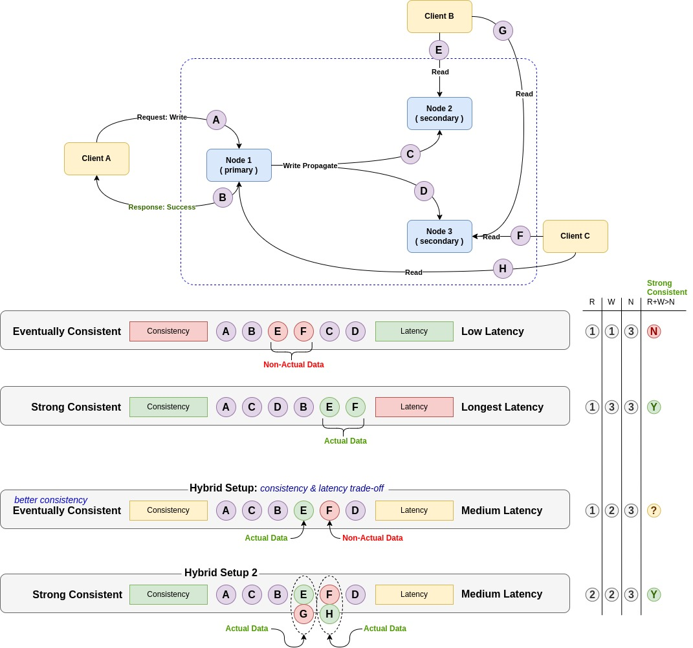

#PACELC theorem

##definition
`extension to CAP theorem` ** in case of **P**artitioning, trade-off between **A**vailability & **C**onsistency, **E**lse trade-off between **L**atency & **C**onsistency.

CAP theorem doesn't talk about when a partition failure:

##Concepts
- **Latency**
  - `general point of view` time delay between the cause and the effect of some physical change in the system being observed.
  - `in distributed system (multi-node database for instance)` time interval between the moment we send a request and the moment we are getting a corresponding response.
    - network latency
    - query latency
    - etc
- **Consistency**
  - **Strong**: `as described in CAP theorem`
  - **Eventual**: guarantee that a write operation will `eventually` take effect for all nodes in a cluster if a system will be operating for long enough.
    - some `time frame different data read` on write node and the others.
    - `eventually` guaranteed that all nodes will return the same data on read call `in case no new writes will be performed before`
    

- `R` number of nodes that `Read Call` will reach out to.
- `W` number of nodes that `Write Call` will be applied to, before responding with success.
- `N` total number of nodes in a cluster.

as we see in provided scenarios in above picture, we can control consistency & latency by changing `R` `N` `M`:
**consistency control:**
- `R + W > N` : Strong consistent
- `R + W <= N` : Eventual Consistent, *some portion of read requests won't be able to read the latest data*

**latency control:** balance between `R` & `W`

